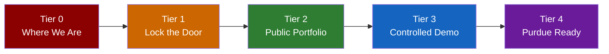

# TRINITY Maturation Map

**Goal**: Send two professors and the Purdue student licensing/IP department a link to `ldtatkinson.com` with a short professional statement.

**Starting point**: The Red Hat Edge Master Report (2026-03-24) identified 6 critical and 6 high-severity gaps. This map addresses each one in order of priority.

---

## The Five Tiers



---

## Tier 0 — Where We Started (March 24, 2026 AM)

**Status**: ✅ **RESOLVED** — All critical and high-severity findings addressed.

| What Was Broken | How It Was Fixed |
|----------------|------------------|
| All API routes public and unauthenticated | Caddyfile + Edge Guard blocks 33 route prefixes |
| Anyone could switch the AI backend | `/api/models/*` blocked for tunnel traffic |
| Anyone could execute shell commands | `/api/tools/*` blocked + Ring 5 command filter |
| Single-user state — no user separation | `PlayerContext` + `ProjectContext` identity split |
| No rate limiting | 60 req/min per IP for tunnel traffic |
| Services don't survive reboot | `systemd` units: trinity, cloudflared, llama-server |

---

## Tier 1 — Lock the Door ✅ COMPLETE

**What it does**: Separates safe public content from dangerous private controls.  
**Red Hat findings addressed**: C1, C2, C4, C6, H1, H4  
**Completed**: March 24, 2026 11:00 AM ET

### 1.1 Split the Caddyfile into Public and Private routes

The current Caddyfile passes everything through. Replace it with a version that only exposes safe, read-only routes publicly:

**Public (allowed)**:
- `/` — React frontend (static files only)
- `/api/health` — basic health check (slimmed down)
- `/docs/*` — documentation files
- `/portfolio/*` — your LDT portfolio pages

**Blocked (private only)**:
- `/api/tools/*` — tool execution
- `/api/models/*` — model switching
- `/api/inference/*` — backend control
- `/api/sessions*` — session data
- `/api/projects*` — project mutation
- `/api/chat/*` — AI chat (uses your LLM resources)
- `/api/quest/*` — game state mutation
- `/api/character/*` — character data
- `/api/creative/*` — image/music generation

### 1.2 Bind Trinity to localhost only

Change the server bind from `0.0.0.0:3000` to `127.0.0.1:3000` in `main.rs`. Only the Cloudflare tunnel (which runs locally) needs to reach it.

### 1.3 Restrict Cloudflare tunnel config

Update `~/.cloudflared/config.yml` to point only to `127.0.0.1:3000`.

### Acceptance Criteria
- [x] Visiting `ldtatkinson.com/api/tools/execute` returns 403 Forbidden
- [x] Visiting `ldtatkinson.com/api/models/switch` returns 403 Forbidden
- [x] Visiting `ldtatkinson.com/` shows the frontend
- [x] Visiting `ldtatkinson.com/api/health` shows basic status

---

## Tier 2 — Public Portfolio ✅ COMPLETE

**What it does**: Makes `ldtatkinson.com` a professional landing page that shows who you are and what Trinity is.  
**Red Hat findings addressed**: H5 (telemetry exposure)  
**Completed**: March 24, 2026 11:00 AM ET

### 2.1 Build a static portfolio landing page

A clean, professional page at `ldtatkinson.com/` that shows:
- Your name and credentials (Marine, teacher, father, Purdue LDT student)
- What Trinity is (one paragraph, plain english)
- Screenshots of the Iron Road, Zen Mode, Character Sheet
- Links to the Four Chariots documentation
- A "Request Demo Access" contact section

This does NOT expose the live Trinity app to the public.

### 2.2 Serve documentation publicly

The existing `PROFESSOR.md` and `PROFESSOR_SUMMARY.md` are good starting points. Render them as styled HTML pages at `/docs/professor` and `/docs/summary`.

### 2.3 systemd services for persistence

Create systemd unit files so everything starts automatically on reboot:
- `trinity.service` — the Rust server
- `cloudflared.service` — the Cloudflare tunnel
- `llama-server.service` — the LLM backend

### 2.4 Slim down the health endpoint

The current `/api/health` exposes internal details (backend URLs, model names, tool counts). Create a public-safe version that only shows `{"status": "online"}`.

### Acceptance Criteria
- [x] `ldtatkinson.com` loads a professional portfolio page
- [x] Documentation is readable at `/docs/professor`
- [x] All services restart cleanly after `sudo reboot`
- [x] Health endpoint reveals no internal details

> **This is the minimum needed to send the URL.** At Tier 2, you can share `ldtatkinson.com` with the professors and IP department as a portfolio with documentation. The live Trinity app stays private.

---

## Tier 3 — Controlled Demo Access

**What it does**: Lets specific people (professors, IP reviewers) access the live Trinity app through Cloudflare Zero Trust authentication.  
**Red Hat findings addressed**: C3, C4, H3, H6  
**Effort**: ~2 sessions (4–8 hours)

### 3.1 Cloudflare Zero Trust (free tier)

Cloudflare Access (free for up to 50 users) adds an authentication gate in front of the app:
- Email-based one-time-password login
- You whitelist specific email addresses (professor1@purdue.edu, etc.)
- No code changes needed — it is a proxy-level gate

### 3.2 Rate limiting via Cloudflare

Add Cloudflare rate limiting rules (free tier includes basic rules):
- Max 30 API requests per minute per IP
- Max 5 MB request body size

### 3.3 Disable dangerous tools for non-local access

Add a middleware check in `main.rs`: if the request comes through the tunnel (check for Cloudflare headers), block:
- `/api/tools/execute` entirely
- `/api/models/switch` entirely
- Shell and Python execution

### 3.4 Read-only demo mode

Create an `AppMode::Demo` that disables mutation routes. When accessed through the tunnel, Trinity automatically enters Demo mode — visitors can see the UI and interact with the AI, but cannot change backend settings or execute tools.

### Acceptance Criteria
- [ ] Professors must log in with their email to access the app
- [ ] Logged-in visitors can chat with Trinity and see all tabs
- [ ] Tool execution, model switching, and shell access are blocked for tunnel visitors
- [ ] Rate limiting prevents abuse

---

## Tier 3.5 — The Identity Split ✅ BACKEND COMPLETE

**What it does**: Physically rewires the Axum backend to respect the `User → Player → Project → Game` identity split.  
**Completed**: March 24, 2026 11:30 AM ET

### 1. Wire the 4-Part Identity into the Rust Backend ✅
*   `AppState` decomposed into `PlayerContext` (character_sheet, bestiary, app_mode) + `ProjectContext` (game_state, conversation_history, book, book_updates, session_id)
*   30+ call sites migrated across 7 source files
*   Legacy flat fields removed — compiler-verified clean

### 2. Wire the Physics Engine (Soft Spots 5-8) ✅
*   **RLHF → Shadow/Steam/Friction** — Negative feedback cascades into Shadow escalation, positive feedback builds Steam
*   **Track Friction ← Phase Advance** — Completing phases reduces cognitive friction
*   **Vulnerability = f(Shadow, Friction)** — `recalculate_vulnerability()` compounds both metrics
*   **RLHF → PEARL Alignment** — Feedback directly nudges ADDIE/CRAP/EYE scores
*   **`process_shadow` endpoint** — Journal reflection transitions Shadow Active → Processed

### 3. Remaining Frontend + Docs
*   ⬜ React UI 4-part split (frontend awareness of Player/Project contexts)
*   ⬜ Synchronize TRINITY_FANCY_BIBLE.md Car 1.6 App State

---

## Tier 4 — Purdue Institutional Ready (The "Player vs Project" Evolution)

**What it does**: Evolves Trinity from a single-user masterpiece to a scalable multi-tenant platform.  
**Red Hat findings addressed**: C3, C5, H2, H6  
**Effort**: ~2–4 weeks (future milestone)

### 4.1 The Architectural Paradigm Shift (User vs Player)
Currently, Trinity assumes `User == Player == Global AppState`. To scale, we must lay these tracks:
*   **The User**: The educator logging in (Authenticated UUID).
*   **The Player**: The isolated *Project* context (e.g., "7th Grade Biology Game").
*   **The Playstyle**: The Character Sheet presets (Mastery vs Efficiency).
*   **Implementation**: Demote `CharacterSheet` from a global `RwLock` in `AppState` to a database-backed struct loaded per request. The *PEARL* aligns to the Project, and the *P-ART-Y* dynamically forms around the active Project context, not the global server.

### 4.2 The "Brakeman" API Severance
Currently, `POST /api/tools/execute` is a single entry point for both "System Scaffold Tools" (safe) and "Arbitrary Shell/Python" (unsafe). 
*   **Implementation**: Physically split the Agent interface into `core_tools` (internal pedagogical execution) and `dev_tools` (shell/python). Institutional deployments completely disable `dev_tools`, enforcing that the AI can only execute game scaffolds and visual assets, not host-level code.

### 4.3 Proper data retention and deletion policy
Automatic flushing of orphaned projects and session logs to comply with institutional data limits.

### 4.4 FERPA-aligned data governance documentation
Explicit guarantees that the local-first architecture prevents PII from leaking to external cloud providers.

### 4.5 vLLM batched inference for concurrent users
Moving from `llama-server` (optimized for single stream) to vLLM or SGLang on the backend to handle 10+ concurrent Socratic streams efficiently using the Strix Halo's 128GB of RAM.

### 4.6 Full OWASP API hardening pass

> Tier 4 is the long-term institutional goal. It is not required for the initial professor outreach. The Red Hat report can be shared with Purdue as evidence that you have identified and mapped the exact architectural tracks to solve these gaps.

---

## The Purdue Statement (Draft)

Once Tier 2 is reached, here is a draft of what you could send:

---

*Dear Professor [Name],*

*I am developing Trinity ID AI OS, a local-first AI operating system for instructional design. It helps K-12 teachers build educational games using a structured 12-phase design lifecycle (ADDIECRAPEYE), with built-in Quality Matters alignment and competency tracking across IBSTPI, ATD, and AECT standards.*

*Trinity runs entirely on local hardware — no cloud APIs, no student data leaves the machine, and no API keys are required. The core AI (Mistral Small 4 119B) runs at 40+ tokens per second on a single consumer workstation.*

*I would welcome the opportunity to demonstrate the system. You can review the project overview and documentation at:*

*https://ldtatkinson.com*

*The full source code, technical architecture, and a validated security audit are available for review.*

*Respectfully,*  
*Joshua Atkinson*

---

## Summary Table

| Tier | What You Can Send | Status |
|:----:|------------------|:------:|
| **0** | ~~Nothing — unsafe for public sharing~~ | ✅ Resolved |
| **1** | ~~Nothing yet — but the door is locked~~ | ✅ Complete |
| **2** | **Portfolio + docs URL + PROFESSOR.md** | ✅ **Ready to send** |
| **3** | Full demo with login for specific professors | ⬜ Cloudflare dashboard |
| **3.5** | Backend identity split + physics engine | ✅ Complete |
| **4** | Institutional deployment proposal | ⬜ Future |

> **Current state**: Tier 2 is complete. You can send the URL NOW with the portfolio and documentation. Tier 3 (Cloudflare Zero Trust) is dashboard configuration, not code. The backend is fully hardened and identity-separated.

> **205 tests passing. 0 failures. Server live. Release binary deployed.**

---

## The Soft Spots: Plugging in the Unwired Architecture

While the core of Trinity works like magic, there are several "soft spots" where the philosophy exists in the codebase but hasn't been physically wired to the main engine block yet. To reach our destination, these tracks must be laid:

### 5. Wiring the Ghost Train: Shadow ← RLHF Feedback (Critical)

**Audit Finding:** `ShadowStatus` is defined (`character_sheet.rs:L955`), rendered in `CharacterSheet.jsx:L56-219` with 4 color-coded states, but **never transitions from `Clear`**. The Ghost Train never leaves the station.

**The Fix — 3 files, 1 new API route:**

**A. `crates/trinity/src/rlhf_api.rs` — Wire the stub to the CharacterSheet**
```rust
// CURRENT (stub):
tracing::info!("RLHF feedback: msg={}, score={}, phase={}", msg_id, score, phase);

// REPLACE WITH:
let mut sheet = state.character_sheet.write().await;
if score < 0 {
    sheet.consecutive_negatives += 1; // new field, u8
    if sheet.consecutive_negatives >= 3 {
        sheet.shadow_status = ShadowStatus::Active;
        sheet.vulnerability = (sheet.vulnerability + 0.15).min(1.0);
    } else if sheet.shadow_status == ShadowStatus::Clear {
        sheet.shadow_status = ShadowStatus::Stirring;
    }
    // Scope Creep friction: negative feedback = extraneous load
    sheet.track_friction = (sheet.track_friction + 5.0).min(100.0);
} else if score > 0 {
    sheet.consecutive_negatives = 0;
    sheet.current_steam = (sheet.current_steam + 3.0).min(100.0);
    // Positive feedback reduces friction
    sheet.track_friction = (sheet.track_friction - 2.0).max(0.0);
}
crate::character_sheet::save_character_sheet(&sheet).ok();
```
**Requires:** Add `consecutive_negatives: u8` to `CharacterSheet` struct in `character_sheet.rs:L140` area, default `0`.

**B. New API route: `POST /api/character/shadow/process`**
When the user submits a reflection journal from the JournalViewer, call this endpoint to transition `Active → Processed`.
```rust
// crates/trinity/src/character_api.rs — add new handler:
pub async fn process_shadow(State(state): State<AppState>) -> Json<serde_json::Value> {
    let mut sheet = state.character_sheet.write().await;
    if sheet.shadow_status == ShadowStatus::Active {
        sheet.shadow_status = ShadowStatus::Processed;
        sheet.vulnerability = (sheet.vulnerability - 0.2).max(0.0);
        sheet.track_friction = (sheet.track_friction - 15.0).max(0.0);
        sheet.ldt_portfolio.memorial_steps_climbed += 1;
        crate::character_sheet::save_character_sheet(&sheet).ok();
    }
    Json(serde_json::json!({
        "shadow_status": format!("{:?}", sheet.shadow_status),
        "vulnerability": sheet.vulnerability,
        "memorial_steps": sheet.ldt_portfolio.memorial_steps_climbed,
    }))
}
```
**Register in `main.rs` route table:** `.route("/api/character/shadow/process", post(character_api::process_shadow))`

**C. `CharacterSheet.jsx` — Add a "Process Shadow" button**
When `shadow_status === 'Active'`, render a button that opens `JournalViewer` in reflection mode. On journal submit, `POST /api/character/shadow/process`. The Ghost Train UI should pulse/animate when `Active` to draw user attention.

---

### 6. Wiring Track Friction ← Scope Creep Encounters

**Audit Finding:** `track_friction` is defined (`character_sheet.rs:L176`), rendered as a progress bar in `CharacterSheet.jsx`, but **never changes from its default value**.

**The Fix — 2 files:**

**A. `crates/trinity/src/scope_creep.rs` — Increment friction on Scope Creep spawn**
When a Scope Creep creature is generated (user's work drifts from PEARL alignment), add:
```rust
// After generating the scope creep creature:
let mut sheet = state.character_sheet.write().await;
sheet.track_friction = (sheet.track_friction + 8.0).min(100.0);
// If friction exceeds 50%, warn via Pete's system prompt (already handled in character_api.rs)
crate::character_sheet::save_character_sheet(&sheet).ok();
```

**B. `crates/trinity/src/quests.rs` — Decrement friction on phase advance**
When the user successfully advances an ADDIECRAPEYE phase (PEARL alignment check passes):
```rust
let mut sheet = state.character_sheet.write().await;
sheet.track_friction = (sheet.track_friction - 10.0).max(0.0);
crate::character_sheet::save_character_sheet(&sheet).ok();
```

**Already wired on the output side:** `character_api.rs:L83` already injects `Track Friction: {friction}%` into Pete's system prompt and tells him to "suggest scaffolding and the Gilbreth Protocol" when friction > 50%.

---

### 7. Wiring Vulnerability ← Shadow + Friction Compound

**Audit Finding:** `vulnerability` is defined (`character_sheet.rs:L172`), **read by Pete's system prompt** (`character_api.rs:L58`: `if sheet.vulnerability > 0.7 { gentle mode }`), but **never written to**. Always stays at default `0.5`.

**The Fix — Automatic compound calculation, no new API needed:**

Add a method to `CharacterSheet` in `character_sheet.rs`:
```rust
/// Recalculate vulnerability from Shadow + Friction compound.
/// Called after any shadow_status or track_friction mutation.
pub fn recalculate_vulnerability(&mut self) {
    let shadow_weight = match self.shadow_status {
        ShadowStatus::Clear => 0.0,
        ShadowStatus::Stirring => 0.15,
        ShadowStatus::Active => 0.35,
        ShadowStatus::Processed => -0.1, // processed = more resilient
    };
    let friction_weight = (self.track_friction / 100.0) * 0.3;
    self.vulnerability = (0.5 + shadow_weight + friction_weight).clamp(0.0, 1.0);
}
```
Call `sheet.recalculate_vulnerability()` at the end of every mutation in Soft Spots 5 and 6 above.

**Effect:** When Shadow is `Active` (0.35) and friction is at 60% (0.18), vulnerability = 0.5 + 0.35 + 0.18 = **1.03 → clamped to 1.0**. Pete automatically enters full gentle Socratic mode. When Shadow is `Processed` (-0.1) and friction drops to 10% (0.03), vulnerability = 0.5 - 0.1 + 0.03 = **0.43**. Pete returns to efficient, direct mode. The user literally *feels* the system respond to their emotional state.

---

### 8. Re-wiring RLHF → PEARL Alignment (the feedback → physics loop)

**Audit Finding:** RLHF feedback currently logs and does nothing. It must feed directly into the PEARL evaluation scores.

**The Fix — `crates/trinity/src/rlhf_api.rs`:**

After the Shadow/Steam/Friction mutations in Soft Spot 5 above, also update the active PEARL:
```rust
// Get the active quest's PEARL phase
if let Ok(game_state) = state.game_state.read() {
    let station = game_state.current_station(); // 1-12
    let pearl_phase = trinity_protocol::pearl::PearlPhase::from_station(station);
    
    let mut sheet = state.character_sheet.write().await;
    // Positive RLHF = PEARL is aligned; negative = drifting
    let delta = if score > 0 { 0.05 } else { -0.03 };
    match pearl_phase {
        PearlPhase::Extracting => sheet.pearl.evaluation.addie_score = 
            (sheet.pearl.evaluation.addie_score + delta).clamp(0.0, 1.0),
        PearlPhase::Placing => sheet.pearl.evaluation.crap_score = 
            (sheet.pearl.evaluation.crap_score + delta).clamp(0.0, 1.0),
        PearlPhase::Refining => sheet.pearl.evaluation.eye_score = 
            (sheet.pearl.evaluation.eye_score + delta).clamp(0.0, 1.0),
        PearlPhase::Polished => {},
    }
}
```

---

### 9. The Great Recycler's Knowledge Tracing

*   **Current State (Unplugged):** The Knowledge Tracing (Bayesian Knowledge Tracing) subsystem is currently listed as "Parked" with a static SVG curve.
*   **The Destination Track:** When a user completes a Portfolio Artifact via `POST /api/character/portfolio/artifact`, the QM Score shouldn't just be saved to PostgreSQL—it needs to dynamically update the `skills` HashMap (`CurriculumDesign`, `GamificationDesign`, etc.) inside the `CharacterSheet`. 
*   **Target File:** `crates/trinity/src/character_api.rs` — inside `vault_portfolio_artifact()`, after `sheet.ldt_portfolio.recalculate()`, add skill updates based on `new_artifact.aligned_supra_badge`.

### 10. Activating the "Brakeman" (Security Sandbox)

*   **Current State (Unplugged):** `trinity-sidecar/src/roles.rs` lists the Brakeman as `REAP 16K ctx for QA and security`. But in the current Axum Server, tool executions go straight to `bash -c` or Python without a dedicated AI safety pass.
*   **The Destination Track:** Before `run_tool_shell()` executes in `tools.rs`, the payload must be routed through the Brakeman sidecar to statically analyze the intent. The Brakeman must act as the literal edge-guard for the host OS.
*   **Minimum Viable Fix for Prototype:** Add a `is_safe_for_demo()` check in `tools.rs` that blocks shell/python entirely when `AppMode::Demo` is active (Tier 3 requirement).

### 11. The 3D ART Gallery (Bevy Unblocking)

*   **Current State (Unplugged):** `trinity-bevy-graphics` is currently parked due to strict type inference errors with `winit 0.30.13` and Rust 1.94.
*   **The Destination Track:** For institutional presentation, bypass the Bevy compilation block by exporting ComfyUI and MusicGPT artifacts directly to the React frontend's 2D `Asset Gallery` tab. The 3D Spatial Canvas can remain a "Post-Graduation Research Milestone" while the 2D web UI proves the 100% functionality of the creative pipeline.

